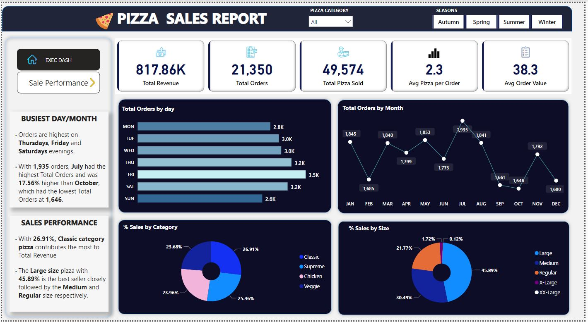
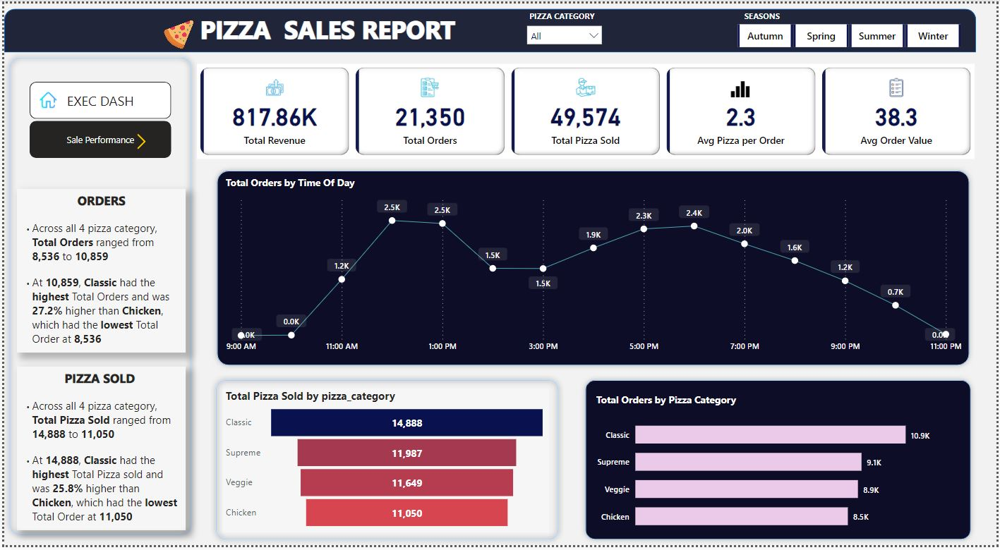

# Pizza Sales Power BI Visualization
Hello there! I am excited to present the results of my Pizza Sales Data Analysis project. I explored a comprehensive dataset containing detailed information about pizza orders, including order details, pizza category, size, quantity, prices, and order dates.

## Problem Statement
The pizza store aims to understand key aspects of its sales data to optimize its business strategies. Some of the specific questions we seek to address are:

- What is the total revenue generated from pizza sales?
- What is the average order value for pizza purchases?
- How many pizzas have been sold in total?
- How many unique orders have been placed?
- What is the average number of pizzas sold per order?

Additionally, we will explore trends related to daily and monthly sales, sales distribution across different pizza categories and sizes, and number of orders.

🧹 **Data Cleaning:** Started by tidying up the data—clarifying types, chasing down Nulls, and removing Duplicates. Clean data, happy analytics! 🧐💻

🔄 **Transforming with DAX:** Used DAX queries to shape the data. Created a new date table, capturing everything from the first to the latest pizza orders. 🗓️📈

## 📊 **Key Stats - The Pizza Chronicles:**
- 💰 Total Revenue: $817,860.05
- 📆 Total Pizza Sold: 49,574
- 🍕 Avg. Pizzas Per Order: 2.3
- 📦 Total Orders: 21,350

## 📈 Dashboard Highlights:
- 📅 Orders per Month
- 📆 Busiest Days for Pizza Sales
- 🕒 Peak Pizza Sales Hours
- 🍽️ Preferred Category & Size
  
  ## Executive Dashboard
  

  ## Sales Performance Dashboard
  

## 📣 **Insights:**
- 🍕 Largest Slice: Large pizzas rule, accounting for 45.89% of sales.
- 🏆 Classics Win: Classic Pizzas steal the spotlight, comprising 26.91% of total sales.
- 🕒 Lunch Rush: 12:00 pm - 1:00 pm emerges as the Peak Hours for pizza lovers.

👩‍💼 **What’s Your Take?**
Fascinated by these pizza insights! What trends do you see? Let’s chat about the analytics of everyone's favorite dish! 🤓🍕 
